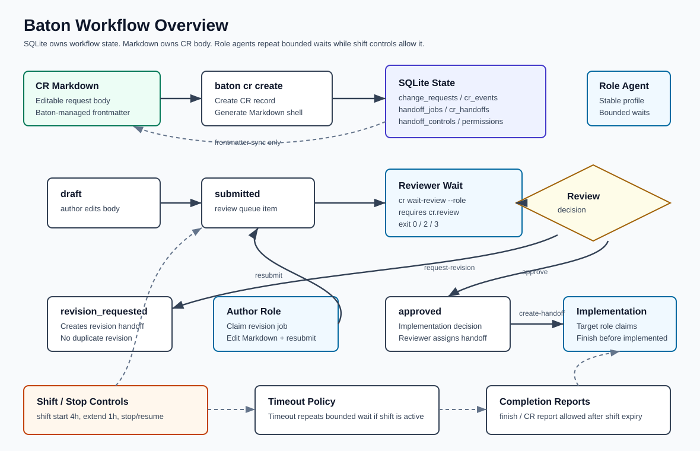

# SQLite Baton Prototype

This is an isolated prototype for testing the SQLite-backed Baton CLI before replacing the repository file-based `tools/handoff` implementation.

The goal is to validate transaction-safe handoff operations, role configuration, dependency promotion, event logging, and bounded wait behavior without affecting the active project handoff queue.

## Quick Start

```bash
bin/baton init
bin/baton role list
bin/baton status
```

Agent prompt:

```text
docs/agent-prompt.md
```

Schema reference:

```text
docs/schema.md
docs/schema-ko.md
```

The default database is:

```text
.baton/baton.sqlite3
```

Use a different database with `--db`:

```bash
bin/baton --db /tmp/baton.sqlite3 init
```

## System Flow



## Role Management

Default roles are seeded by `init`:

```text
sm
planning
architecture
backend
frontend
qa
devops
ui-design
backend-design
```

Add a temporary role:

```bash
bin/baton role add content-design --display-name "Content Design"
```

Add an alias:

```bash
bin/baton role alias-add fe frontend
bin/baton next --role fe
```

CR review permissions are stored separately from role membership. `sm` is seeded with all CR review permissions.

```bash
bin/baton role permission-list sm
bin/baton role permission-add architecture cr.review
bin/baton role permission-add architecture cr.approve
```

## Agent Identity

Use a stable profile name as the primary agent identity.

```bash
bin/baton agent init --role frontend --agent-id frontend-main
bin/baton claim HO-YYYY-MM-DD-001 --role frontend
```

Recommended profile names:

```text
sm
frontend-main
backend-main
qa-regression
ui-design-main
backend-design-main
devops-main
architecture-main
```

Profile names are intentionally human-assigned. Do not rely on Codex thread IDs, turn IDs, or temporary files as the only long-lived agent identity. Runtime IDs can be appended in logs when available, but the profile name should remain stable across app restarts and context compaction.

Identity resolution order for `claim`:

1. `--claimed-by`
2. `BATON_AGENT_ID`
3. `--agent-id-file` or `BATON_AGENT_ID_FILE`
4. role name

Use `agent init` only as a local convenience for storing the selected profile name:

```bash
bin/baton agent init --role frontend --agent-id frontend-main
bin/baton agent show
```

The default identity file is ignored by git:

```text
.baton/agent-id
```

If multiple agents share one workspace, do not let them share the same default identity file unless they intentionally represent the same profile. In that case, use `--claimed-by` or `BATON_AGENT_ID` with the assigned profile name for each agent.

## Handoff Flow

Register a ready handoff:

```bash
bin/baton register \
  --title "Frontend upload follow-up" \
  --role frontend \
  --source-ref "docs/change-requests/CR-YYYY-MM-DD-example.md" \
  --objective "Implement the approved upload follow-up." \
  --exit-criteria "The approved UI behavior is implemented and verified."
```

Register a dependent handoff:

```bash
bin/baton register \
  --title "QA regression" \
  --role qa \
  --depends-on HO-YYYY-MM-DD-001 \
  --objective "Verify the completed implementation." \
  --exit-criteria "QA evidence is recorded."
```

Promote ready blocked work:

```bash
bin/baton promote-ready
```

Claim and finish:

```bash
bin/baton next --role frontend
bin/baton claim HO-YYYY-MM-DD-001 --role frontend
bin/baton finish HO-YYYY-MM-DD-001 --role frontend --evidence "Manual verification passed."
```

Inspect events:

```bash
bin/baton events HO-YYYY-MM-DD-001
```

## Change Request Flow

CR Markdown files hold the editable request body. SQLite is the authority for workflow state and Baton keeps only the Markdown frontmatter in sync.

Create and submit a CR:

```bash
bin/baton cr create \
  --title "Upload policy" \
  --author-role planning \
  --reviewer-role sm

bin/baton cr submit CR-YYYY-MM-DD-001 --role planning
```

Reviewer roles can wait for submitted CRs:

```bash
bin/baton cr wait-review --role sm --timeout 900 --interval 30
```

If the CR needs more work, request a revision. Baton creates a revision handoff for the author role, and another revision cannot be requested until the CR is resubmitted.

```bash
bin/baton cr request-revision CR-YYYY-MM-DD-001 \
  --role sm \
  --reason "Acceptance criteria is unclear."
```

The author role edits the CR Markdown body, resubmits the CR, then finishes the revision handoff:

```bash
bin/baton cr resubmit CR-YYYY-MM-DD-001 \
  --role planning \
  --evidence "Acceptance criteria clarified."

bin/baton finish HO-YYYY-MM-DD-001 \
  --role planning \
  --evidence "CR resubmitted."
```

Approval and implementation assignment are separate decisions:

```bash
bin/baton cr approve CR-YYYY-MM-DD-001 \
  --role sm \
  --evidence "Ready for implementation."

bin/baton cr create-handoff CR-YYYY-MM-DD-001 \
  --by-role sm \
  --role frontend \
  --title "Implement upload policy UI" \
  --objective "Implement the approved upload policy UI." \
  --exit-criteria "UI behavior matches the approved CR."
```

Mark a CR implemented only after every implementation handoff is finished:

```bash
bin/baton cr mark-implemented CR-YYYY-MM-DD-001 \
  --role sm \
  --evidence "Implementation handoffs finished."
```

## Transaction Model

State-changing commands run inside `BEGIN IMMEDIATE` transactions:

- `role add`
- `role alias-add`
- `role permission-add`
- `register`
- `claim`
- `finish`
- `promote-ready`
- `stop`
- `resume`
- `shift start`
- `shift extend`
- `shift end`
- `cr create`
- `cr submit`
- `cr resubmit`
- `cr request-revision`
- `cr approve`
- `cr reject`
- `cr create-handoff`
- `cr mark-implemented`

This is intended to replace ad-hoc lock files for ID assignment and state transitions.

Read-only commands do not claim ownership:

- `role list`
- `role permission-list`
- `status`
- `next`
- `events`
- `control status`
- `shift status`
- `cr status`
- `cr events`

## Tests

Run smoke tests:

```bash
tests/smoke.sh
tests/concurrent-claim.sh
tests/wait-stop.sh
tests/agent-id.sh
tests/cr-flow.sh
tests/shift.sh
```

The concurrent claim test starts two separate CLI processes against the same open job and expects exactly one claim to succeed.

## Wait Prototype

`wait` repeatedly promotes ready work and checks the target role queue.

```bash
bin/baton wait --role frontend --timeout 900 --interval 30
```

Exit behavior:

- `0`: ready job found
- `2`: timeout
- `3`: stopped by control flag

`--timeout 0` means wait forever, but that should be used only in explicit experiments. Normal workers should repeat bounded waits until their shift expires or a stop control is set.

`cr wait-review` uses the same stop/resume controls and exit codes, but checks submitted CRs assigned to the reviewer role instead of handoff jobs.

## Shift Controls

Shift controls define how long a role agent should keep starting new waits or claims. They do not block completion reports for work that was already in progress.

Start or extend a role shift:

```bash
bin/baton shift start --role frontend
bin/baton shift extend --role frontend
```

`shift start` defaults to `4h`. `shift extend` defaults to `1h`. Use `--duration` to override either default.

End a shift explicitly:

```bash
bin/baton shift end --role frontend --reason "End of day"
```

Inspect shift state:

```bash
bin/baton shift status --role frontend
```

When a shift expires, Baton marks the matching control scope stopped. Future `wait`, `cr wait-review`, and `claim` attempts stop or fail, while `finish` and CR reporting commands remain allowed.

## Stop And Resume

Stop and resume control is stored in SQLite, not in flag files.

Stop all waiters:

```bash
bin/baton stop --all --reason "End of day"
```

Stop one role:

```bash
bin/baton stop --role frontend --reason "Pause frontend polling"
```

Resume:

```bash
bin/baton resume --all
bin/baton resume --role frontend
```

Inspect control state:

```bash
bin/baton control status
```

Stop/resume commands do not move jobs or change job status. They only affect future `wait` loop behavior.

`resume` clears a manual stop flag. If the shift deadline has already expired, use `shift extend` or `shift start` before re-entering a wait loop.

`stop` writes the stop flag immediately. A running wait loop exits the next time it checks the flag, so response can be delayed by up to the current `--interval`.

## Limitations

- It does not import or export Markdown handoff files.
- It does not enforce a full permission model beyond target-role claim/finish checks.
- It is not the active repository handoff workflow.

## License

Baton is licensed under the Apache License, Version 2.0. See [LICENSE](LICENSE) and [NOTICE](NOTICE).
